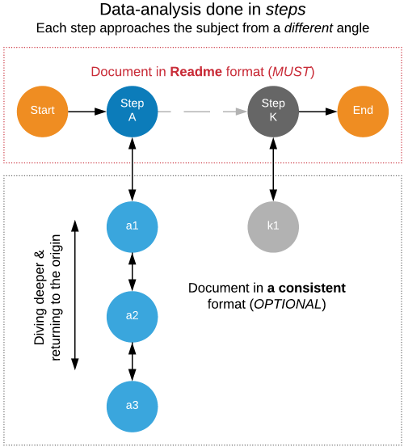

## General

### Write down your own recipes, share them, collect feedback, and reflect
This exercise, which should in fact be carried out by almost all members of the society, has the following benefits:
* establishes transparency in your work
* prevents you from forgetting hard-learned lessons
* provides others with an opportunity to learn from your practices

### Not only write to explain, but also write to explore
Do not wait to document until you clarify your problem and have something to show for others.

Use writing as a learning tool. Why? Because writing:
* Forces us to be clear
* Crystallizes what we do not understand
* Opens the way to dialogue with others

### Embrace README driven analysis
If we start documentation right from the beginning and attempt to **record everything in an unstructured format**, we probably end up with a large number of documents, which would make it difficult to digest the content and would even cause the analysis to loose its way during the _recording_ process.

Solution? — README files.

Why? — Because they are concise, easy to read, and _relatively_ easy to create. Besides, we need only _one_ of them for the whole project.

What do we record on them? — As depicted on the following figure, analyses -- iterative or linear -- comprise a sequence of distinct exploration tasks (*Step A, ..., K*), each of which also comprise a sequence of interrelated subtasks (*a1, a2, ...*).

On your README file, record only those distinct exploration tasks without diving deeper into the subtasks and their results.

This whole exercise will help you maintain your focus and enable you to articulate your decisions, findings and actions more easily.

### Keep a journal of case studies
Always document problems that you have worked on.

Keep full accounts of the problems that business teams have faced, step-by-step recreations the engagements, evaluated solutions and a rough estimate of the created value.

### Start the body of work with a _silly_ hypothesis
At the beginning of an engagement, you might know nothing about the business, nothing about the problem, nothing about the data. Doesn't matter! State a silly hypothesis to test and move forward with the validation.

At worst, you build momentum in your work and get familiar with the contents, quirks, and limitations of the data that you have to deal with later. At best, you and your client learn something new in a very short period of time.

### Sit at the table until the very end
Define the deliverables of your work as follows:
1. A logically and numerically sound analysis
2. A short list of *call-to-action* items, each of which is
    + easy-to-understand
    + realistic
    + consistent with the client's existing strategy — *at least to some degree*
3. A seat on the table where
    + proposed *call-to-action* items will be prioritized
    + execution plans will be created
    + execution status will be tracked
    + results will be evaluated

TODO: explain the purpose of (3)

### Build a solid writing habit
Data analysts often face with the challenge of demonstrating their sophistication as a communicator, which requires them to develop advanced writing skills. To achieve effectiveness in writing, book 15~30 min everyday in your calendar and practice.

### Be thoughtful while using jargon and acronyms in your documents
> AGC issues are highly associated with SR churn.

Although such beginnings might be common in presentations and emails reporting analysis findings, and although _some_ clients might not have much difficulty in decoding such abbreviations, it would be wise to spell out terms on their first occurrence.

Please consider _future yourself_ as one of the current clients as well, and prepare documents accordingly.

### Aim high while defining your role as an analyst
Say you work for an insurance company, and the property insurance team wants you to take a look at existing policyholder information and publicly available flood risk data to investigate if there are things that they need to reconsider in their operations.

And say you define your deliverable as creating either one of the following:

1. An excel file where each row contains a single policy and associated flood-risk
1. *In addition to 1*, a slide deck reporting details of the analysis and listing *call-to-action* items
1. *In addition to 2*, a web application that enables clients to interactively interact with the findings (for example, a map of policyholder regions and associated risks)
1. *In addition to 3*, proposal of business processes that will complete *call-to-action* items
1. *In addition to 4*, proposal of a new product that is based on the findings of the numerical analyses

What value do you think you would generate under those 5 scenarios if we would run this thought experiment on a thousand similar engagements? — Distribution of generated business values would probably look like this:

Going from *raw data servicing* to *new product proposals*, your value proposition would increase exponentially. Challenges would definitely increase exponentially too, but do not let those challenges define your role.

[Return to README](https://github.com/srctaha/recipes-for-data-analysis/blob/master/README.md)
