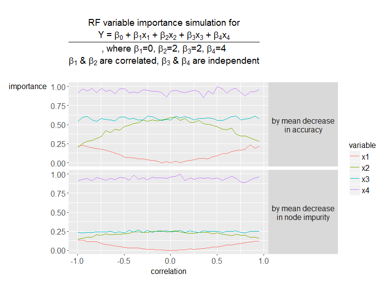
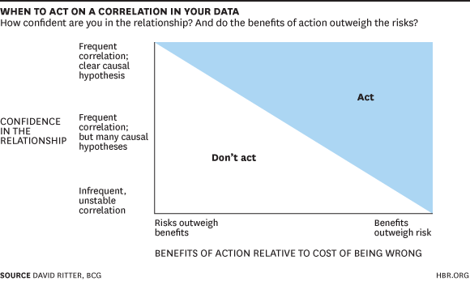

## Statistics

### Get rid of _statistics_, whenever you can
If you did not receive a formal statistics education before, you might feel uncomfortable with the statistics-speak.

If that is the case, you might want to consider using the following instead, which by the way, is nothing but generating random numbers within _for loops_.

* Simulation
* Shuffling
* Bootstraping
* Cross-validation

### Look at raw data
By looking at the raw data, you will not only gain a better understanding of the data -- the very same thing that you have to deal with going forward --, but also a **better intuition of the problem domain**. Looking at the raw data alone might be sufficient to produce well-defined hypotheses to test and learn from.

While looking at raw data, however, you should pay special attention to common cases. As common cases might induce bias to your understanding, you should do *stratified sampling* and look at samples across the distribution of values.

### Look at variable distributions
While business teams frequently monitor _means_, _medians_, and _standard deviations_ of the key variables, data analysts should look at the _distributions_ for a better understanding of the underlying phenomena.

_Histograms_, _Q-Q plots_, _frequency distributions_, _contingency tables_ and _scatter plots_ would help to analyze variable distributions and to visualize multi-modality or groups of outliers, if there are any.

### Look at outliers


You should look at the outliers in your data, as they can be canaries in the coal mine for more fundamental problems with your analysis.

It is fine to exclude them from your data or to lump them together into an *Unusual* category, but you should make sure you know why data ended up in that category.

For example, looking at the queries with the lowest click-through rate (CTR) may reveal clicks on elements in the user interface that you are failing to count. Looking at queries with the highest CTR may reveal clicks you should not be counting.

On the other hand, some outliers you will never be able to explain so you need to be careful in how much time you devote this.

### Report noise & confidence
> We must be aware that randomness exists everywhere and will fool us. If you aren't careful, you will find patterns in the noise.
>
> Every estimator that you produce should have a notion of your confidence in this estimate attached to it. Sometimes this will be more formal and precise (through techniques such as confidence intervals or credible intervals for estimators, and p-values or Bayes factors for conclusions) and other times you will be more loose.
>
> For example, if a colleague asks you how many queries about frogs we get on Mondays, you might do a quick analysis looking at a couple of Mondays and report "usually something between 10 and 12 million" (not real numbers).

### Slice your data
> Slicing means to separate your data into subgroups and look at the values of your metrics in those subgroups separately. In analysis of web traffic, we commonly slice along dimensions like mobile vs. desktop, browser, locale, etc. If the underlying phenomenon is likely to work differently across subgroups, you must slice the data to see if it is. Even if you do not expect a slice to matter, looking at a few slices for internal consistency gives you greater confidence that you are measuring the right thing. In some cases, a particular slice may have bad data, a broken experience, or in some way be fundamentally different.
>
> Anytime you are slicing your data to compare two groups (like experiment/control, but even time A vs. time B comparisons), you need to be aware of mix shifts. A mix shift is when the amount of data in a slice is different across the groups you are comparing. Simpson's paradox and other confusions can result. Generally, if the relative amount of data in a slice is the same across your two groups, you can safely make a comparison.

### Consider practical significance
Statistical significance ≠ Practical significance

Namely, neither statistical significance guarantees practical significance, nor practical significance requires statistical significance.

With a sufficient volume of data, it can be tempting to focus solely on statistical significance or to hone in on the details of every bit of data. But you need to ask yourself, *Even if it is true that value X is 0.1% more than value Y, does it matter?*.

This can be especially important if you are unable to understand or categorize part of your data. If you are unable to make sense of some user agents strings in our logs, whether it is 0.1% of 10% makes a big difference in how much you should investigate those cases.

On the flip side, you sometimes have a small volume of data. Many changes will not look statistically significant but that is different than claiming it is "neutral". You must ask yourself *How likely is it that there is still a practically significant change?*.

### Check for consistency over time
> One particular slicing you should almost always employ is to slice by units of time (we often use days, but other units may be useful also).
>
> This is because many disturbances to underlying data happen as our systems evolve over time. Typically the initial version of a feature or the initial data collection will be checked carefully, but it is not uncommon for something to break along the way.
>
> Just because a particular day or set of days is an outlier does not mean you should discard it. Use the data as a hook to find a causal reason for that day being different before you discard it.
>
> The other benefit of looking at day over day data is it gives you a sense of the variation in the data that would eventually lead to confidence intervals or claims of statistical significance. This should not generally replace rigorous confidence interval calculation, but often with large changes you can see they will be statistically significant just from the day-over-day graphs.

### Standardize features before applying regularization
TODO:

### Understand how *multi-collinearity* effects your feature importances


Above figure shows how Random Forest feature importances are effected by *multi-collinearity*. A similar phenomenon could be observed with the absolute values of linear and logistic regression model coefficients, which sometimes are interpreted as feature importances.

*Multi-collinearity* among feature variables -- even you standardize all of them -- makes it difficult to correctly estimate feature importances. Unimportant features seem important, and important ones become indistinguishable from the unimportant ones. And the bad news is that the more features you have in your model, the more likely you will be exposed to this phenomenon.

Therefore under *multi-collinearity* conditions, report feature importances with a grain of salt.

### Separate _validation_, _description_, and _evaluation_
> Exploratory data analysis has 3 interrelated stages, and by separating them, you can more easily reach agreement with others.
>
> 1. `Validation or Initial Data Analysis`: Do I believe data is self-consistent, that the data was collected correctly, and that data represents what I think it does? This often goes under the name of "sanity checking". For example, if manual testing of a feature was done, can I look at the logs of that manual testing? For a feature launched on mobile devices, do my logs claim the feature exists on desktops?
> 2. `Description`: What's the objective interpretation of this data? For example, "Users do fewer queries with 7 words in them?", "The time page load to click (given there was a click) is larger by 1%", and "A smaller percentage of users go to the next page of results."
> 3. `Evaluation`: Given the description, does the data tell us that something good is happening for the user, for Google, for the world? For example, "Users find results faster" or "The quality of the clicks is higher."
>
> Description should be things that everyone can agree on from the data.
>
> Evaluation is likely to have much more debate because you imbuing meaning and value to the data.
>
> If you do not separate Description and Evaluation, you are much more likely to only see the interpretation of the data that you are hoping to see.
>
> Further, Evaluation tends to be much harder because establishing the normative value of a metric, typically through rigorous comparisons with other features and metrics, takes significant investment.
>
> These stages do not progress linearly. As you explore the data, you may jump back and forth between the stages, but at any time you should be clear what stage you are in.

### Confirm data collection setup
> Before looking at any data, make sure you understand data collection setup.
>
> Communicating precisely between the experimentalist and the analyst is a big challenge. If you can look at experiment protocols or configurations directly, you should do it. Otherwise, write down your own understanding of the setup and make sure the people responsible for generating the data agree that it's correct.
>
> You may spot unusual or bad configurations or population restrictions (such as valid data only for a particular browser). Anything notable here may help you build and verify theories later. Some things to consider:
>
> * If it's a features of a product, try it out yourself. If you can't, at least look through screenshots/descriptions of behavior.
> * Look for anything unusual about the time range the experiment ran over (holidays, big launches, etc.)

### Check vital signs
> Before actually answering the question you are interested in (e.g. "Did users use my awesome new feature?") you need to check for a lot of other things that may not be related to what you are interested in but may be useful in later analysis or indicate problems in the data.
>
> * Did the number of users change?
> * Did the right number of affected queries show up in all my subgroups?
> * Did error rates changes?
>
> Just as your doctor always checks your height, weight, and blood pressure when you go in, check your data vital signs to catch potential big problems.
>
> This is one important part of the "Validation" stage.

### Standard first, custom second
> This is a variant of checking for what shouldn't change.
>
> Especially when looking at new features and new data, it's tempting to jump right into the metrics that are novel or special for this new feature. But you should always look at standard metrics first, even if you expect them to change.
>
> For example, when adding a brand new UI feature to the search page, you should make sure you understand the impact on standard metrics like clicks on results before diving into the special metrics about this new UI feature. You do this because standard metrics are much better validated and more likely to be correct.
>
> If your new, custom metrics don't make sense with your standard metrics, your new, custom metrics are likely to be wrong.

### Measure twice, or more
> Especially if you are trying to capture a new phenomenon, try to measure the same underlying thing in multiple ways, and check to see if these multiple measurements are consistent.
>
> By using multiple measurements, you can identify bugs in measurement or logging code, unexpected features of the underlying data, or filtering steps that are important. It is even better if you can use different data sources for the measurements.

### Check for _reproducibility_
> Both slicing and consistency over time are particular examples of checking for reproducibility. If a phenomenon is important and meaningful, you should see it across different user populations and time. But reproducibility means more than this as well. If you are building models of the data, you want those models to be stable across small perturbations in the underlying data. Using different time ranges or random sub-samples of your data will tell you how reliable/reproducible this model is. If it is not reproducible, you are probably not capturing something fundamental about the underlying process that produced this data.

### Check for consistency with past measurements
> Often you will be calculating a metric that is similar to things that have been counted in the past. You should compare your metrics to metrics reported in the past, even if these measurements are on different user populations.
>
> For example, if you are looking at measuring search volume on a special population and you measure a much larger number than the commonly accepted number, then you need to investigate. Your number may be right on this population, but now you have to do more work to validate this.
>
> * Are you measuring the same thing?
> * Is there a rational reason to believe these populations are different?
>
> You do not need to get exact agreement, but you should be in the same ballpark. If you are not, assume that you are wrong until you can fully convince yourself. Most surprising data will turn out to be a error, not a fabulous new insight.

### New metrics should be applied to old data & features first
> If you gather completely new data and try to learn something new, you won't know if you got it right. When you gather a new kind of data, you should first apply this data to a known feature or data.
>
> For example, if you have a new metric for user satisfaction, you should make sure it tells you your best features help satisfaction.
>
> Doing this provides validation for when you then go to learn something new.

### Make hypotheses and look for evidence
> Exploratory data analysis for a complex problem is typically iterative.
>
> You will discover anomalies, trends, or other features of the data. Naturally, you will make hypotheses to explain this data. It's essential that you don't just make a hypothesis and proclaim it to be true. Look for evidence (inside or outside the data) to confirm/deny this theory. For example, If you believe an anomaly is due to the launch of some other feature or a holiday in Katmandu, make sure that the population the feature launched to is the only one affected by the anomaly. Alternatively, make sure that the magnitude of the change is consistent with the expectations of the launch.
>
> Good data analysis will have a story to tell. To make sure it's the right story, you need to tell the story to yourself, predict what else you should see in the data if that hypothesis is true, then look for evidence that it's wrong. One way of doing this is to ask yourself the following:
>
> **What experiments would I run that would validate/invalidate the story I am telling?**
>
> Even if you don't/can't do these experiments, it may give you ideas on how to validate with the data that you do have.
>
> The good news is that these hypotheses and possible experiments may lead to new lines of inquiry that transcend trying to learn about any particular feature or data. You then enter the realm of understanding not just this data, but deriving new metrics and techniques for all kinds of future analyses.

### Exploratory analysis benefits from end-to-end iteration
> When doing exploratory analysis, you should strive to get as many iterations of the whole analysis as possible.
>
> Typically you will have multiple steps of signal gathering, processing, modeling, etc. If you spend too long to get the very first stage of your initial signals perfect you are missing out on opportunities to get more iterations in the same amount of time. Further, when you finally look at your data at the end, you may make discoveries that change your direction. Therefore, your initial focus should not be on perfection but on getting something reasonable all the way through.
>
> Leave notes for yourself and acknowledge things like filtering steps and data records that you can't parse/understand, but trying to get rid of all of them is a waste of time at the beginning of exploratory analysis.

### It is OK to take action based on correlation only


`Correlation ≠ Causation`, but also `!Proof-of-causation ⇏ !Action`

Being unable to prove causation should not stop you making recommendations for action. Consider both **risks of being wrong** and **merits of being correct**, and call for action accordingly.

[Return to README](https://github.com/srctaha/recipes-for-data-analysis/blob/master/README.md)

### Don't underestimate the variability in small samples
The law of small numbers says that people underestimate the variability in small samples. As an analyst, you shouldn't.

Let's say that in the past, 80% of the partner companies responded positively to a special deal. You repeat the same deal, but this time, less than 9 partners out of 12 responded positively (<75%). Is this something you need to worry about?

If you run the following simulation in R, you will see that there is a 20% chance to observe such an outcome, which is not insignificant.

```R
library(magrittr)

set.seed(123)
num_repetitions <- 10000
num_draws <- 12

x <- sapply(1:num_repetitions, FUN=function(x) {
    sample(x=c(0,1), size=num_draws, replace=TRUE, prob=c(0.2,0.8)) %>% sum
})
sum(x<9) / num_repetitions
```
