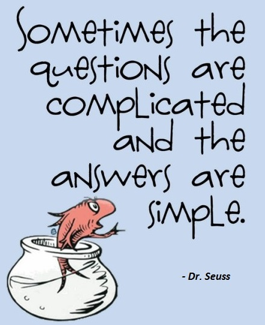

# Recipes for _success_ in data analysis

## Social

### Data analysis starts with questions

And neither with data nor with a technique.

There is always a reason that you are doing some analysis. If you take the time to formulate the needs, questions or hypotheses, it will go a long way towards making sure that you are gathering the data you should be gathering and that you are thinking about the possible gaps in the data.

Of course, questions you ask can and should evolve as you look at the data. But analysis without a proper question will end up aimless.

Furthermore, you have to avoid the trap of finding some favorite technique and then only finding the parts of problems that this technique works on. Again, making sure you are clear what the questions are will help you avoid this.

### Ask yourself: _What decision(s) would this analysis lead to?_
Effective data analyses would lead to decisions of the following type:
* product change
* business flow change
* personnel change
* strategy change

However unpredictable the outcome of your analysis may seem, have an idea about which subset of the given possibilities are more likely to happen under the current business environment and adjust your focus or _direction_ accordingly.

### Ask yourself: _Would my finding(s) lead to a change in the decisions?_
This is a necessary yes/no question that should be addressed as soon as possible.

You may wonder _why would anyone, for god's sake, ask to analyze something, which is guaranteed to lead nowhere_. It might be due to insufficient knowledge on your client's end, or more rarely, due to office politics.

### Ask yourself: _How important is the decision my analysis suggesting relative to other decisions that my client has to make?_
Have an idea about the decision backlog of your client.

The motivation of your client during the first engagement does not unfortunately guarantee the support/interest/time you will get from him/her going forward. This exercise would help you adjust your energy.

### Prepare a single sentence to summarize your findings
Yes, a single sentence. This will become handy while conveying progress to managers with short attention spans.

### Tell a story first

You can hardly persuade people with only facts, let alone with only probability or statistics. If this would not be the case, there would not be an advertisement industry as we know today.

So sharpen your creativity and speaking skills, and prepare a story that would explain the gist of your findings. Do not forget to update your story based on the feedback that you will get from co-workers and clients throughout the engagement.

### Document and communicate what you are filtering
Almost every data analysis starts by filtering the data in various stages ― region, time period, customer segment. Whatever the case, you must acknowledge the type of filtering you are conducting, document and communicate it properly.

### Count how much is being filtered at each of your steps
> Often the best way to do the latter is to actually compute all your metrics even for the population you are excluding. Then you can look at that data to answer questions like "What fraction of queries did my filtering remove?"
>
> Further, looking at examples of what is filtered is also essential for filtering steps that are novel for your analysis. It's easy to accidentally include some "good" data when you make a simple rule of data to exclude.

### Ratios should have clear numerator and denominators
> Many interesting metrics are ratios of underlying measures, but unfortunately, there is often ambiguity of what your ratio is.
>
> For example, if I say click-through rate of a site on search results, is it:
> * `# clicks on site / # results for that site`, or
> * `# search result pages with clicks to that site / # search result pages with that site shown`, or stg else?
>
> When you communicate results, you must be clear about this. Otherwise your audience (and you!) will have trouble comparing to past results and interpreting a metric correctly.

### Educate your consumers
> You will often be presenting your analysis and results to people who are not data experts. Part of your job is to educate them on how to interpret and draw conclusions from your data. This runs the gamut from making sure they understand confidence intervals to why certain measurements are unreliable in your domain to what typical effect sizes are for "good" and "bad" changes to understanding population bias effects.
>
> This is especially important when your data has a high risk of being misinterpreted or selectively cited. You are responsible for providing the context and a full picture of the data and not just the number a consumer asked for.

### Be both *skeptic* and *champion*
> As you work with data, you must be both the champion of the insights you are gaining as well as a skeptic.
>
> You will hopefully find some interesting phenomena in the data you look at. When you have an interesting phenomenon you should ask both "What other data could I gather to show how awesome this is?" and "What could I find that would invalidate this?". Especially in cases where you are doing analysis for someone who really wants a particular answer (e.g. "My feature is awesome") you are going to have to play the skeptic to avoid making errors.

### Share with peers first, clients second
> A skilled peer reviewer can provide qualitatively different feedback and sanity-checking than the consumers of your data can, especially since consumers generally have an outcome they want to get.
>
> Ideally, you will have a peer that knows something about the data you are looking at, but even a peer with just experience looking at data in general is extremely valuable. Previous points suggested some ways to get yourself to do the right kinds of sanity checking and validation. But sharing with a peer is one of the best ways to force yourself to do all these things. Peers are useful at multiple points through the analysis. Early on you can find out about gotchas your peer knows about, suggestions for things to measure, and past research in this area. Near the end, peers are very good at pointing out oddities, inconsistencies, or other confusions.

### Expect and accept ignorance and mistakes
> There are many limits to what we can learn from data.
>
> Nate Silver makes a strong case in The Signal and the Noise that only by admitting the limits of our certainty can we make advances in better prediction. Admitting ignorance is a strength but it is not usually immediately rewarded. It feels bad at the time, but will ultimately earn you respect with colleagues and leaders who are data-wise. It feels even worse when you make a mistake and discover it later (or even too late!), but proactively owning up to your mistakes will translate into credibility.
>
> _Credibility_ is the key social value for any data scientist.

### Report on relationships among directly observable quantities
This depends on the data literacy of your clients, but in most cases, your results should focus on relationships among directly observable quantities.

TODO: Add the case of `t-SNE`.

### Move your desk to *genba*
Whenever possible, pack your stuff and temporarily move next to team running the business under microscope.

TODO: Explain why

### Know your client
The better you understand your client, the more likely your analysis will be able to help.

Try to figure out if your client is:
* well or badly informed about his data
* well or badly informed about his problems or goals
* well or badly informed about his business
* focused or indecisive
* clear or vague
* intuitive or analytic
